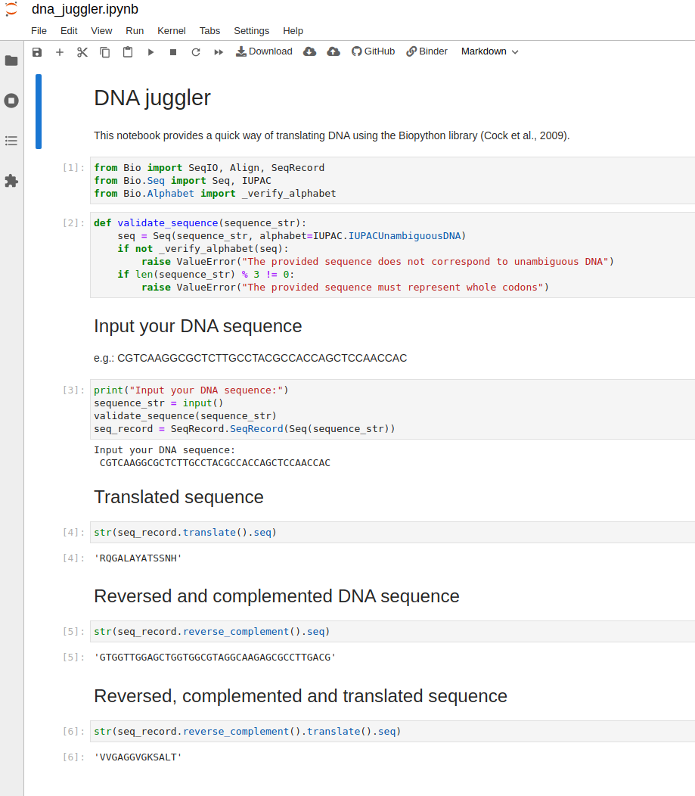
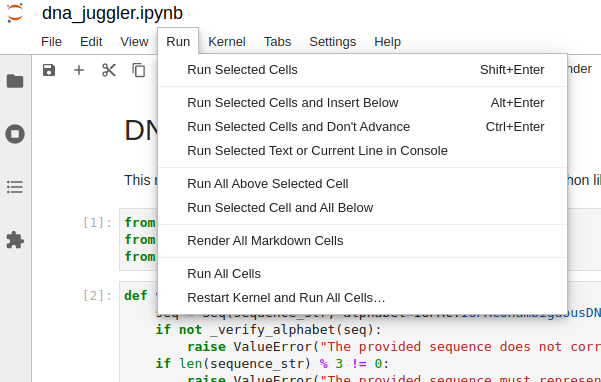
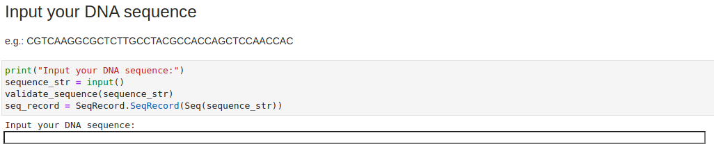

# DNA juggler

The DNA juggler provides a quick way of translating a DNA sequence into an amino acid sequence using the Biopython library (Cock et al., 2009) inside a convenient Jupyter notebook graciously provided by mybinder.org.
Given a DNA sequence it returns the translated amino acid sequence.
Additionally it returns the reversed and complemented DNA sequence, which is handy for genes in the negative strand.

First click the binder buttom above. After the environment is initialized you should see an interactive Jupyter notebook as in the screenshot below:

Run all cells:

And provide the input DNA sequence:

Et voila! Enjoy

